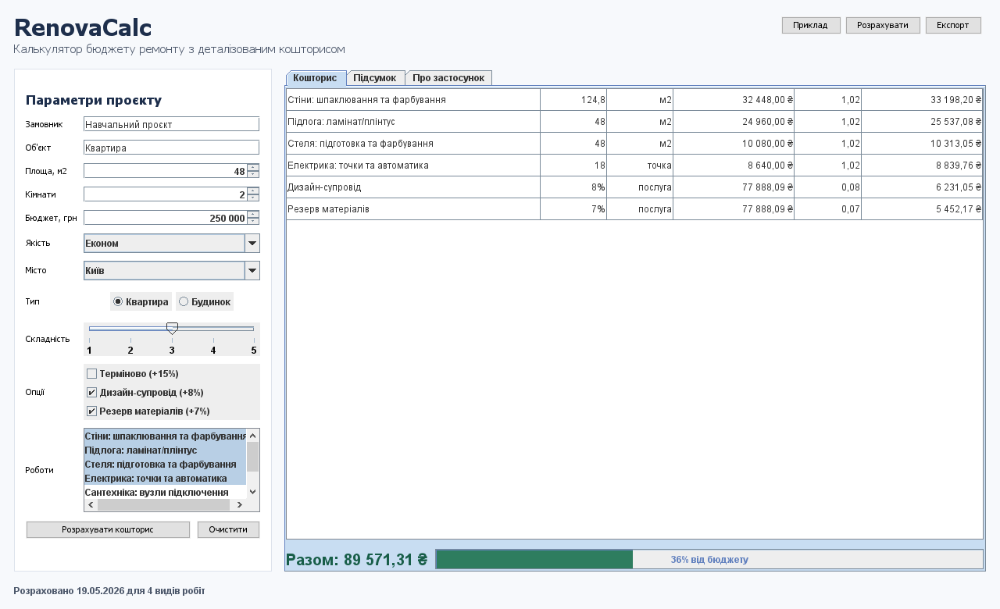
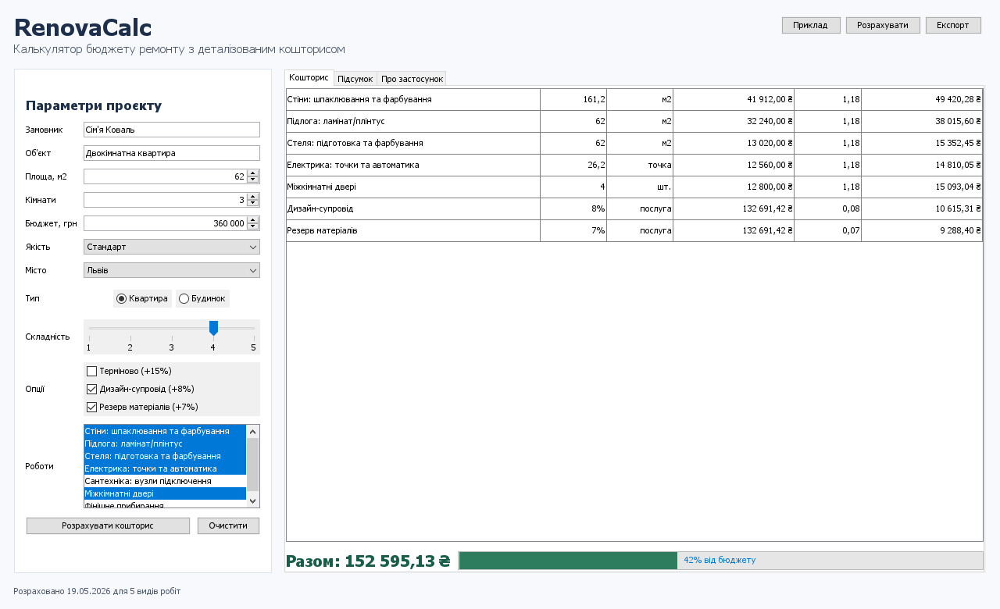

# Звіт про виконання проєкту

## Постановка завдання

Розробити завершений Java-застосунок з графічним інтерфейсом користувача, який має практичне призначення, демонструє роботу з основними GUI-компонентами та може бути розміщений у GitHub-репозиторії разом зі звітом і скриншотами.

## Призначення проєкту

Проєкт **RenovaCalc** - це калькулятор орієнтовної вартості ремонту. Користувач вводить площу, кількість кімнат, місто, бюджет, рівень якості, складність і набір робіт. Програма формує деталізований кошторис, показує суму робіт, додаткові нарахування, загальну вартість та індикатор використання бюджету.

## Засоби розроблення

- Мова програмування: Java 21.
- Бібліотека графічного інтерфейсу: Java Swing.
- Система контролю версій: Git.
- Середовище запуску: Windows, PowerShell.

## Опис роботи програми

1. Користувач заповнює параметри ремонту в лівій частині вікна.
2. У списку вибирає потрібні види робіт.
3. Натискає кнопку **Розрахувати кошторис**.
4. На вкладці **Кошторис** відображається таблиця з деталізацією.
5. На вкладці **Підсумок** формується текстовий звіт.
6. Через кнопку **Експорт** можна зберегти кошторис у текстовий файл.

## Використані компоненти інтерфейсу

У застосунку використано більше ніж 5 типів компонентів:

- `JFrame` - головне вікно програми.
- `JPanel` - групування елементів інтерфейсу.
- `JLabel` - підписи та заголовки.
- `JTextField` - введення замовника й об'єкта.
- `JSpinner` - введення площі, кімнат і бюджету.
- `JComboBox` - вибір міста та рівня якості.
- `JCheckBox` - додаткові опції кошторису.
- `JRadioButton` - вибір типу об'єкта.
- `JSlider` - вибір складності.
- `JList` - вибір видів робіт.
- `JTable` - таблиця кошторису.
- `JTextArea` - текстовий підсумок.
- `JButton` - виконання команд.
- `JTabbedPane` - вкладки результатів.
- `JProgressBar` - показ використання бюджету.
- `JMenuBar` - меню програми.
- `JFileChooser` - вибір файлу для експорту.

## Формула розрахунку

Основна сума для кожного виду робіт:

```text
сума = обсяг * ціна_за_одиницю * коефіцієнт_якості * коефіцієнт_міста * коефіцієнт_типу_об'єкта * коефіцієнт_складності * коефіцієнт_кімнат
```

Після цього додаються додаткові нарахування: терміновість, дизайн-супровід і резерв матеріалів.

## Скриншоти роботи

Початковий екран:



Приклад розрахованого кошторису:



## Посилання на репозиторій

GitHub: https://github.com/FunkyPotato7/java_project

## Висновок

У результаті розроблено завершений навчальний Java Swing застосунок із практичним призначенням. Програма демонструє роботу з формами введення, списками, таблицями, вкладками, меню, діалогами файлів і динамічним оновленням результатів.
